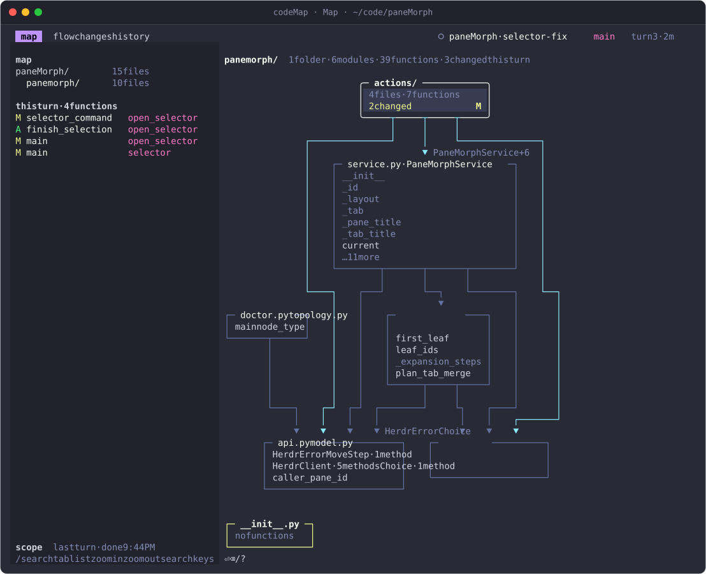
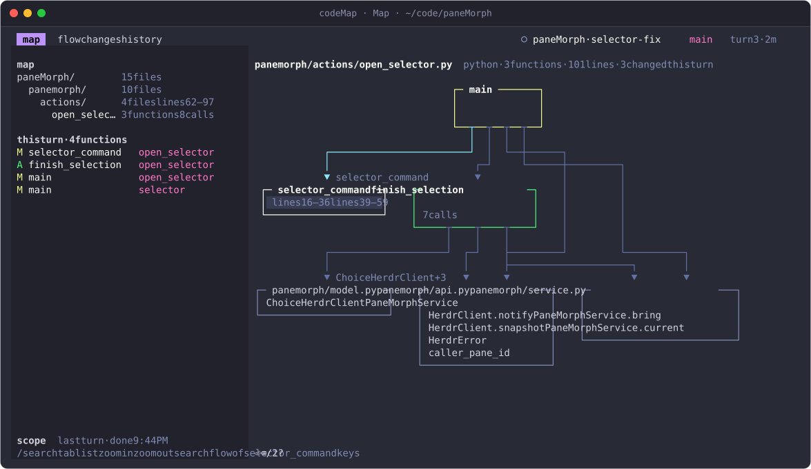
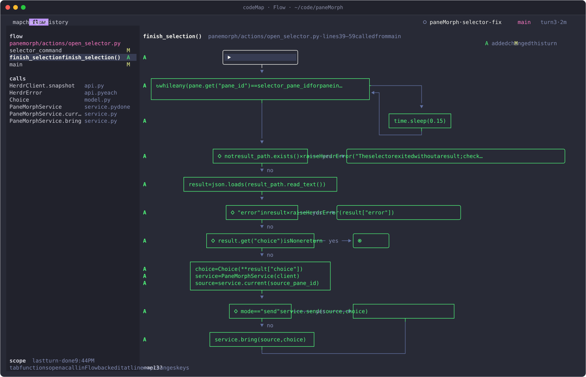
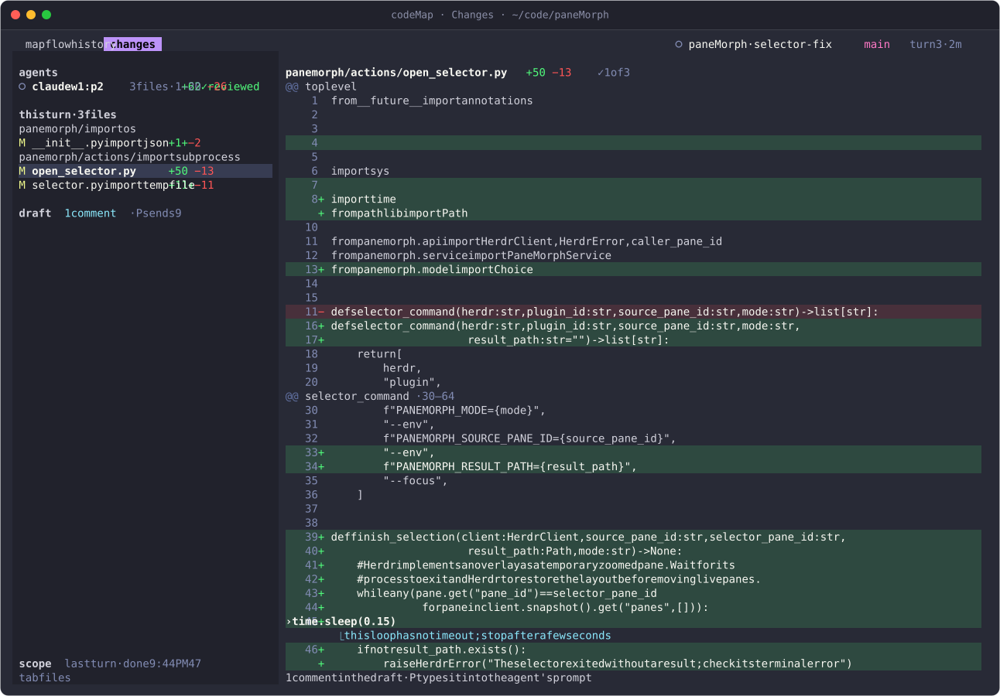
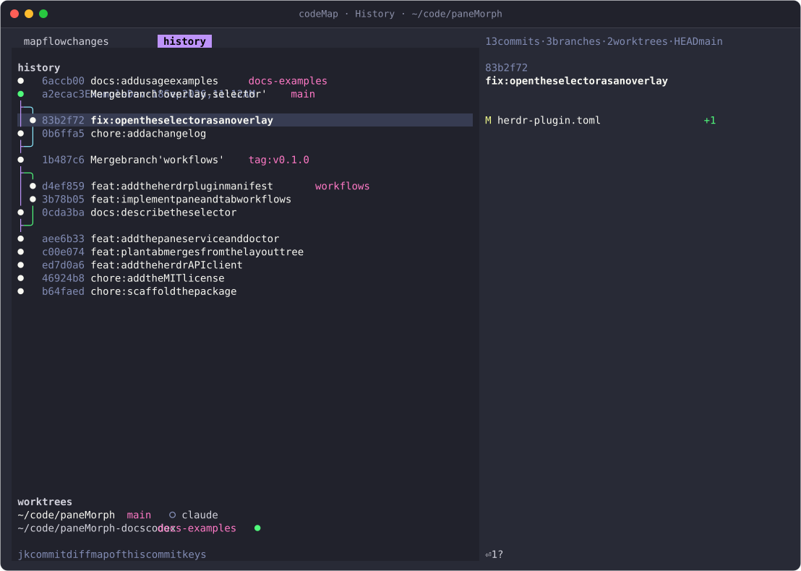
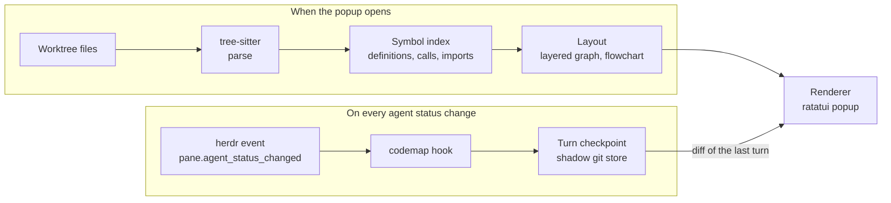

<div align="center">

# codeMap

**See your code as a map, and what your agents changed on it.**

[](https://github.com/Jenish-Shobhit/codeMap/actions/workflows/ci.yml)
[](https://github.com/Jenish-Shobhit/codeMap/releases/latest)
[](LICENSE)
[](https://herdr.dev)
[](https://www.rust-lang.org)

[Install](#install) · [Keybindings](#keybindings) · [Usage](#usage) · [How it works](#how-it-works) · [FAQ](#troubleshooting-and-faq) · [Contributing](CONTRIBUTING.md) · [Changelog](CHANGELOG.md)

</div>

<p align="center">
  
</p>

## Why

Coding agents change more code in a turn than anyone reads line by line, and a
diff alone does not show where a change sits in the codebase. codeMap is a
[herdr](https://herdr.dev) plugin that opens over the agent you are watching and
shows its worktree as a map, a function as a flowchart, the last turn as a
reviewable diff, and the history as a graph, so you see the shape of the code
and what just changed without opening files one by one.

## Features

- **Four views, one key.** ⌃⌥M opens a popup over the focused agent's pane with
  Map, Flow, Changes and History, switched with `1`–`4`.
- **Turn-aware.** An event hook snapshots the worktree whenever an agent starts
  or finishes a turn, so every view knows what the last turn did: `M` for
  changed, `A` for added.
- **Review without leaving the terminal.** Mark hunks reviewed, comment on
  lines, and send the comments to the agent's prompt as one message.
- **Parsed, not grepped.** tree-sitter grammars for Python, Rust,
  TypeScript/TSX, JavaScript and Go, with calls and imports resolved across
  files.
- **Read-only.** Checkpoints live in codeMap's own state directory. Your
  repository gets no refs, no stash and no index changes.
- **Fast.** The frame paints in under a millisecond and a small repository is
  loaded in about 100 ms. Huge repositories parse one folder at a time.
- **Follows herdr's theme**, including all 18 built-in palettes and custom
  colours.
- **Works outside herdr too:** `codemap [path]` opens the same views in any
  terminal.

## Requirements

- [herdr](https://herdr.dev) 0.9.0 or newer, on macOS or Linux.
- `git` on your `PATH`.
- To install from GitHub, herdr builds codeMap with `cargo`, which needs Rust
  1.90 or newer ([rustup](https://rustup.rs)) and a C compiler for the
  tree-sitter grammars: Xcode's command line tools on macOS, `gcc` or `clang`
  on Linux. The [prebuilt binaries](#prebuilt-binaries) need neither.
- For the ⌃⌥M chord, a terminal with the Kitty keyboard protocol, such as
  Ghostty or kitty. Other chords work in any terminal; see the
  [FAQ](#m-does-nothing-or-arrives-as-).

## Install

### From GitHub

```sh
herdr plugin install Jenish-Shobhit/codeMap
```

herdr previews the manifest and its build command (`cargo build --release`)
before it runs anything. Add `--ref v0.1.0` to pin a release, or `--yes` to
skip the prompt. Then [bind a key](#keybindings) and check the plugin:

```sh
herdr plugin list                               # dev.codemap, enabled
herdr plugin action list --plugin dev.codemap   # open, flow, changes, history
```

To update, run the install command again; herdr replaces its checkout. To
remove codeMap, run `herdr plugin uninstall dev.codemap`.

### From a local checkout

```sh
git clone https://github.com/Jenish-Shobhit/codeMap
cd codeMap
cargo build --release        # `herdr plugin link` does not run build steps
herdr plugin link "$PWD"
```

The manifest runs `target/release/codemap` from the plugin directory, so
rebuild after you pull. `herdr plugin unlink dev.codemap` removes the plugin
and leaves the files.

### Prebuilt binaries

Every [release](https://github.com/Jenish-Shobhit/codeMap/releases/latest) has
archives for macOS (`aarch64-apple-darwin`, `x86_64-apple-darwin`) and static
Linux binaries (`aarch64-unknown-linux-musl`, `x86_64-unknown-linux-musl`).
Each archive is a ready-to-link plugin directory. Extract it somewhere
permanent, since herdr runs the binary from there:

```sh
v=v0.1.0 t=aarch64-apple-darwin
curl -LO "https://github.com/Jenish-Shobhit/codeMap/releases/download/$v/codemap-$v-$t.tar.gz"
curl -LO "https://github.com/Jenish-Shobhit/codeMap/releases/download/$v/codemap-$v-$t.tar.gz.sha256"
shasum -a 256 -c "codemap-$v-$t.tar.gz.sha256"      # sha256sum -c on Linux
tar -xzf "codemap-$v-$t.tar.gz"
herdr plugin link "$PWD/codemap-$v-$t"
```

## Keybindings

codeMap declares four herdr actions. Bind the one that opens the Map in
`~/.config/herdr/config.toml`:

```toml
[[keys.command]]
key = "ctrl+alt+m"
type = "plugin_action"
command = "dev.codemap.open"
description = "codeMap: map of the focused agent's code"
```

Then run `herdr config check` and `herdr server reload-config`. To open
straight into another view, bind `dev.codemap.flow`, `dev.codemap.changes` or
`dev.codemap.history` the same way.

Inside the popup:

| Keys | Where | Action |
| --- | --- | --- |
| `1` `2` `3` `4` | everywhere | Map, Flow, Changes, History |
| `tab` | Map, Flow, Changes | move between the rail and the body |
| `/` | everywhere | search a function, class or file; `↑` `↓` pick, `⏎` go |
| `e` / `y` | Map, Flow, Changes | open `$EDITOR` at the line / copy `path:line` |
| `p` / `T` | inside herdr | pin codeMap as a split that follows the focused pane / open it in its own tab |
| `?` | everywhere | show every key |
| `q` or `⎋` | everywhere | close |
| `←` `→` `↑` `↓` | Map | move between boxes |
| `j` `k` | Map | move through a box's rows (a file's functions, a class's methods) |
| `⏎` / `⌫` | Map | zoom in (folder, file, then the Flow of a function) / zoom out |
| `]` `[` | Map | next or previous page of a big folder |
| `↑` `↓` `←` `→` | Flow | move between boxes |
| `⏎` / `⌫` | Flow | open the call in the box / go back |
| `j` `k`, `]` `[`, `}` `{` | Changes | next or previous line, hunk, file |
| `space` | Changes | mark the hunk reviewed (kept until the hunk changes) |
| `v`, `c`, `x` | Changes | select lines, comment on them, delete a comment |
| `P` / `S` | Changes | type the draft into the agent's prompt and close / submit it through herdr's `agent.prompt` |
| `s` / `a` | Changes, Map | scope: last turn, the agent's session, since `HEAD` / next agent |
| `j` `k`, `⏎`, `⌫` | History | move between commits, show the diff, go back |
| `1` | History | the Map with this commit's changes marked |

The popup takes every key while it is open: nothing reaches herdr or the agent
until it closes.

## Usage

Press ⌃⌥M over an agent's pane. codeMap opens a popup at 94% × 92% on that
pane's working directory: its foreground cwd, so it follows an agent that
changed directory, and otherwise its herdr worktree. The header names the
workspace, tab, branch and turn, as in `○ paneMorph · selector-fix  main  turn 3 · 2m`.

The screenshots show [paneMorph](https://github.com/Jenish-Shobhit/paneMorph)'s
code with one recorded agent turn. They are rendered from the real UI by
`cargo run --example screenshots`, and CI checks that they are current.

### Map



Folders, files, classes and functions as boxes, and calls and imports as
lines, in a layered layout. The map opens at folder level; `⏎` zooms into a
folder, then a file (above), then the Flow of a function, and
`⌫` zooms out. The rail lists the functions the last turn changed. Boxes for
code outside the current folder show where calls lead.

### Flow



The selected function as a flowchart: statements, decisions, loops,
try/except, match and returns, with branches merging back below. The gutter
marks each line the turn added (`A`) or changed (`M`). `⏎` on a box opens the
function it calls, and `⌫` comes back.

### Changes



The agent's last turn, file by file and hunk by hunk. `s` widens the scope to
the agent's whole session, then to everything since `HEAD`. `space` marks a
hunk reviewed; the mark stays until the hunk changes. Select lines with `v`,
press `c`, and write a comment. `P` types the draft into the agent's prompt as
one message for you to send:

```text
Review comments from codeMap:

panemorph/actions/open_selector.py:43-45 — this loop has no timeout; stop after a few seconds
```

`S` submits it straight away through herdr's `agent.prompt`. If the agent is
waiting on a question, codeMap says so and keeps the draft.

### History



The commit graph with branches, tags and `HEAD`, and the repository's worktrees
with the herdr agents working in each (`●` working, `○` idle). `⏎` shows a
commit's diff, and `1` opens the Map with that commit's changes marked.

## Standalone

The binary runs without herdr:

```sh
codemap                          # the current directory
codemap path/to/repo --view flow
codemap doctor                   # where codeMap looks for herdr, its theme and state
codemap --help
```

It is `target/release/codemap` in the plugin directory; link it onto your
`PATH` to use it anywhere. Outside herdr there is no focused agent, so Changes
starts at "since `HEAD`"; turns the hook recorded in that repository are still
one `s` away. Pinning (`p`, `T`) and sending comments need herdr.

## Supported languages

| Language | Files | Flow shows |
| --- | --- | --- |
| Python | `.py` `.pyi` | `if`/`elif`/`else`, `for`, `while`, `try`/`except`/`finally`, `with`, `match`, `return`, `raise` |
| Rust | `.rs` | `if`/`else`, `loop`, `while`, `for`, `match`, `return`, `break`, `continue` |
| TypeScript | `.ts` `.tsx` `.mts` `.cts` | `if`/`else`, `for`, `for…in`/`of`, `while`, `do`, `switch`, `try`/`catch`/`finally`, `return`, `throw` |
| JavaScript | `.js` `.jsx` `.mjs` `.cjs` | as TypeScript |
| Go | `.go` | `if`/`else`, `for`, `switch`, type switches, `select`, `return`, `goto` |

Map and Flow cover all five. Files in other languages appear on the map as
plain boxes with their size, binary files as `binary · 24 KB`, and Flow names
the grammars it has.

## Configuration and theme

codeMap has no settings file of its own; it follows herdr.

- **Keys:** the `[[keys.command]]` entries above.
- **Theme:** herdr has no theme API, so codeMap reads `[theme]` from herdr's
  `config.toml` (`name`, `auto_switch` with `dark_name`, `[theme.custom]` and
  `[theme.custom.dark]`) and resolves it the way herdr does, with herdr's 18
  built-in palettes. With `auto_switch`, codeMap cannot see the host's
  appearance and uses the dark theme. The screenshots use `name = "dracula"`
  with `sidebar_bg = "#21222c"`.
- **Paths:** herdr's config comes from `HERDR_CONFIG_PATH`, else
  `$XDG_CONFIG_HOME/herdr/config.toml`, else `~/.config/herdr/config.toml`.
  Turn checkpoints go to the plugin state directory herdr assigns
  (`~/.local/state/herdr/plugins/dev.codemap/` by default);
  `CODEMAP_STATE_DIR` overrides it.

## How it works



**Reading code.** The popup paints its frame first, then worker threads list
the worktree's files, parse them with tree-sitter and build a symbol index:
definitions from tags-style queries, calls and imports resolved to the files
and symbols they name. The Map lays the index out as a layered (Sugiyama)
graph: layers, crossing reduction, then coordinates, drawn with box characters.
Flow turns one function's syntax tree into a structured chart that runs down
one spine, with branches in columns to the right. Above 1,500 source files,
codeMap parses a folder when you zoom into it.

**Recording turns.** herdr runs `codemap hook` on every
`pane.agent_status_changed` event. A change to `working` starts a turn; a
change from `working` to `idle`, `done` or `blocked` ends it, and answering a
question (`blocked` to `working`) continues the same turn. Each boundary
snapshots the worktree into a shadow git directory, and the diff between the
two snapshots is the turn. The hook takes about 60 ms, and the last 50 turns
per agent are kept.

| Measured on an Apple silicon Mac, release build | Time |
| --- | --- |
| Process start to first paint | 0.6 ms in process, full frame 5 ms after spawn |
| Small repository (11 files), content loaded | 66–100 ms |
| codeMap's own source (63 files) | about 230 ms |
| 12,000-file repository, first paint / loaded | 0.3 ms / about 110 ms |
| History of 2,000 commits | about 20 ms |
| Hook, per turn boundary | about 60 ms |

## Privacy and safety

**codeMap never writes into your repository.** No refs, no stash, no index
changes, no objects.

- Snapshots go to a shadow git directory in the plugin's state directory
  (`…/dev.codemap/repos/<repo>/shadow.git`), with its own objects, index and
  refs, and your worktree as its work tree.
- Commands that write objects never see your object store, so git cannot
  "freshen" (touch) objects in it. Read-only diffs borrow it for one process
  through `GIT_ALTERNATE_OBJECT_DIRECTORIES`.
- The "since `HEAD`" diff reads a private copy of your index.
- The test suite fingerprints every file under `.git` before and after each
  operation, and fails on any change.
- codeMap makes no network requests. It talks only to the local herdr socket,
  and sends text to an agent only when you press `P` or `S`.

Reviewed marks and unsent comments are stored next to the checkpoints. Delete
the state directory to forget them.

## Troubleshooting and FAQ

### ⌃⌥M does nothing, or arrives as ⌥⏎

Without the Kitty keyboard protocol, ⌃M is the same byte as Return, so ⌃⌥M
reaches herdr as ⌥⏎. Use a terminal that supports the protocol, such as
Ghostty or kitty, or bind a chord every terminal can send, such as
`prefix+m`:

```toml
[[keys.command]]
key = "prefix+m"
type = "plugin_action"
command = "dev.codemap.open"
description = "codeMap: map of the focused agent's code"
```

### The first launch after a build is slow

On macOS the first run of a newly built binary takes about 0.7 s while the
system checks it; later launches paint in milliseconds. If you downloaded a
release archive with a browser and macOS refuses to run it, clear the
quarantine flag: `xattr -dr com.apple.quarantine codemap-v0.1.0-*`.

### Nothing is marked M or A

No turn has been recorded for this agent yet: the hook starts recording once
the plugin is installed, at the agent's next turn. Until then the scope is
"since `HEAD`"; press `s` to cycle scopes.

### Where do I look when something fails?

- `codemap doctor` prints the herdr socket, config, theme, state directory and
  how many agents have turns in the current repository.
- `herdr plugin log list --plugin dev.codemap` shows each action and hook run
  with its output.
- `herdr plugin list` shows whether the plugin is enabled and any manifest
  warnings.

### The install fails at `cargo build`

The GitHub install builds from source and needs `cargo` 1.90+ and a C
compiler on the `PATH` that herdr sees. Install them, or use a
[prebuilt binary](#prebuilt-binaries).

## Roadmap

Ideas under consideration, not commitments:

- Step through earlier turns, not only the last one and the session.
- More languages through tree-sitter: Java, C and C++, Ruby.
- Follow the host's light or dark appearance when herdr's `auto_switch` is on.
- Export a map or a flowchart as text or SVG.

Suggestions are welcome in [issues](https://github.com/Jenish-Shobhit/codeMap/issues).

## Contributing

Bug reports, fixes and new languages are welcome. [CONTRIBUTING.md](CONTRIBUTING.md)
covers the setup, the checks CI runs, the snapshot tests and how to run the
live tests against a throwaway herdr server. Everyone taking part follows the
[Code of Conduct](CODE_OF_CONDUCT.md).

## Security

Please report vulnerabilities privately through
[GitHub's private vulnerability reporting](https://github.com/Jenish-Shobhit/codeMap/security/advisories/new);
see [SECURITY.md](SECURITY.md).

## License

codeMap is released under the [MIT License](LICENSE). Copyright (c) 2026
Jenish Shobhit.

[NOTICE](NOTICE) lists third-party material: the colour palettes ported from
herdr (Apache-2.0), and the tree-sitter runtime and grammars (MIT) that the
binaries include.

---

Sibling project: [paneMorph](https://github.com/Jenish-Shobhit/paneMorph)
moves live herdr panes between tabs without restarting their processes.
